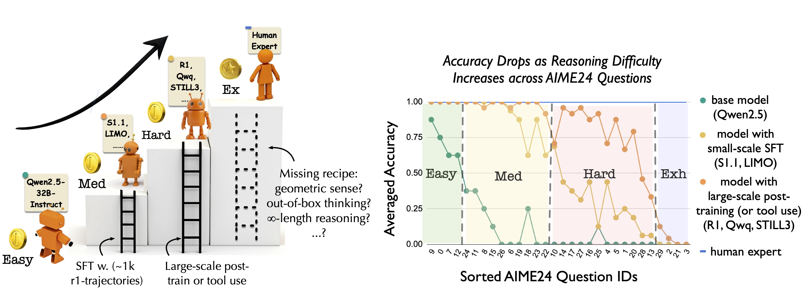

<div align="center">
  <h1>Climbing the Ladder of Reasoning: What LLMs Can—and Still Can’t—Solve after SFT?</h1>
  <p> 
    A systematic study on the potential and limitations of Supervised Fine-Tuning (SFT) on math reasoning tasks
  </p>
</div>

---

### 🚩 Key Takeaways

1. **Careful curation of small-scale SFT datasets provides marginal gain.**  
   Across a wide range of math categories, model performance varies marginally (~1%) between curated and randomly constructed datasets.

2. **Potential vs. Stability.**  
   Small-scale SFT models can match Deepseek-R1 in *total* solved AIME24 questions when given multiple attempts. However, they struggle with consistent accuracy due to instability in deep exploration and multi-step computation.

3. **Scaling the SFT dataset matters.**  
   Contrary to recent claims (Muennighoff et al., 2025; Ye et al., 2025), simply increasing the dataset size yields performance gains. Still, returns diminish on Hard-level problems, indicating a performance plateau.

4. **Higher-level reasoning remains elusive.**  
   SFT-trained models often converge on similar solution strategies, suggesting fundamental limitations in developing higher-level reasoning solely through SFT.

<p align="center">
  
</p>

---

This repository provides all resources for the paper:  
**["Climbing the Ladder of Reasoning: What LLMs Can—and Still Can’t—Solve after SFT?"](https://github.com/sunblaze-ucb/reasoning_ladder/blob/main/paper/SFT_reasoning_ladder.pdf)**

### 📦 Contents
- [Artifacts](#artifacts)
- [Training](#training)
- [Evaluation](#evaluation)
- [Citation](#citation)

---

### 📁 Artifacts

- **📄 Paper**:  
  [SFT_reasoning_ladder.pdf](https://github.com/sunblaze-ucb/reasoning_ladder/blob/main/paper/SFT_reasoning_ladder.pdf)

- **🤖 Models**:  
  Available on Hugging Face: https://huggingface.co/sunyiyou/

  - **By Category**:  
    Format: `https://huggingface.co/sunyiyou/openr1_{category}_1k_lg_{seed}`  
    - Categories: `algebra`, `number_theory`, `geometry`, `calculus`, `combinatorics`, `inequalities`, `logic_and_puzzles`, `diverse`  
    - Seeds: `0`, `1`, `2`, `3`

  - **By Dataset Size**:  
    | Samples | Link |
    |---------|------|
    | 100 | [openr1_diverse_100_lg](https://huggingface.co/sunyiyou/openr1_diverse_100_lg) |
    | 200 | [openr1_diverse_200_lg](https://huggingface.co/sunyiyou/openr1_diverse_200_lg) |
    | 500 | [openr1_diverse_500_lg](https://huggingface.co/sunyiyou/openr1_diverse_500_lg) |
    | 1K | [openr1_diverse_1k_lg_{seed}](https://huggingface.co/sunyiyou/openr1_diverse_1k_lg_0) |
    | 2K | [openr1_lg_2k_ep4](https://huggingface.co/sunyiyou/openr1_lg_2k_ep4) |
    | 5K | [openr1_lg_5k_ep4](https://huggingface.co/sunyiyou/openr1_lg_5k_ep4) |
    | 10K | [openr1_lg_10k_ep4](https://huggingface.co/sunyiyou/openr1_lg_10k_ep4) |
    | 20K | [openr1_lg_20k_ep4](https://huggingface.co/sunyiyou/openr1_lg_20k_ep4) |
    | 114K | [OpenThinker-32B](https://huggingface.co/open-thoughts/OpenThinker-32B) |
    | 1M | [OpenThinker2-32B](https://huggingface.co/open-thoughts/OpenThinker2-32B) |

  - **By Trajectory Length**:  
    - [Short](https://huggingface.co/sunyiyou/openr1_diverse_1k_sh)  
    - [Normal](https://huggingface.co/sunyiyou/openr1_diverse_1k_nm)  
    - [Long](https://huggingface.co/sunyiyou/openr1_diverse_1k_lg_0)

  - **By Trajectory Style**:  
    - [Gemini-style](https://huggingface.co/simplescaling/s1-32B)  
    - [R1-style](https://huggingface.co/simplescaling/s1.1-32B)

  - **By Similarity to AIME24**:  
    - [Similar](https://huggingface.co/sunyiyou/openr1_sim_aime24mdhd_1k_0)  
    - [Dissimilar](https://huggingface.co/sunyiyou/openr1_insim_aime24mdhd_1k_0)

- **🗃️ Datasets**:  
  Available in the same Hugging Face links above. You can find curated datasets with different sizes, styles, and similarity levels to AIME24 under the same naming conventions.

---

### 🛠️ Training

Please refer to the instructions in [`train/README.md`](train/README.md) for training your own models.

---

### 🧪 Evaluation

Instructions can be found in [`eval/README.md`](eval/README.md).  
To save compute:

1. Download our evaluation results and prediction trajectories from [here](https://drive.google.com/drive/folders/1dC2W6qd1Y0wWh8GfhQpSTX1MzGBX4HDE?usp=sharing).
2. Place them into the `results/` folder.
3. Visualize with:

```bash
python view_results.py
```

---

### 📚 Citation

If you find our work helpful, please cite:

```bibtex
@article{sun2025climbing,
  author = {Sun, Yiyou and Zhou, Georgia and Wang, Hao and Li, Dacheng and Dziri, Nouha and Song, Dawn},
  title = {Climbing the Ladder of Reasoning: What LLMs Can---and Still Can't---Solve after SFT?},
  journal = {Preprint},
  year = {2025},
}
```
